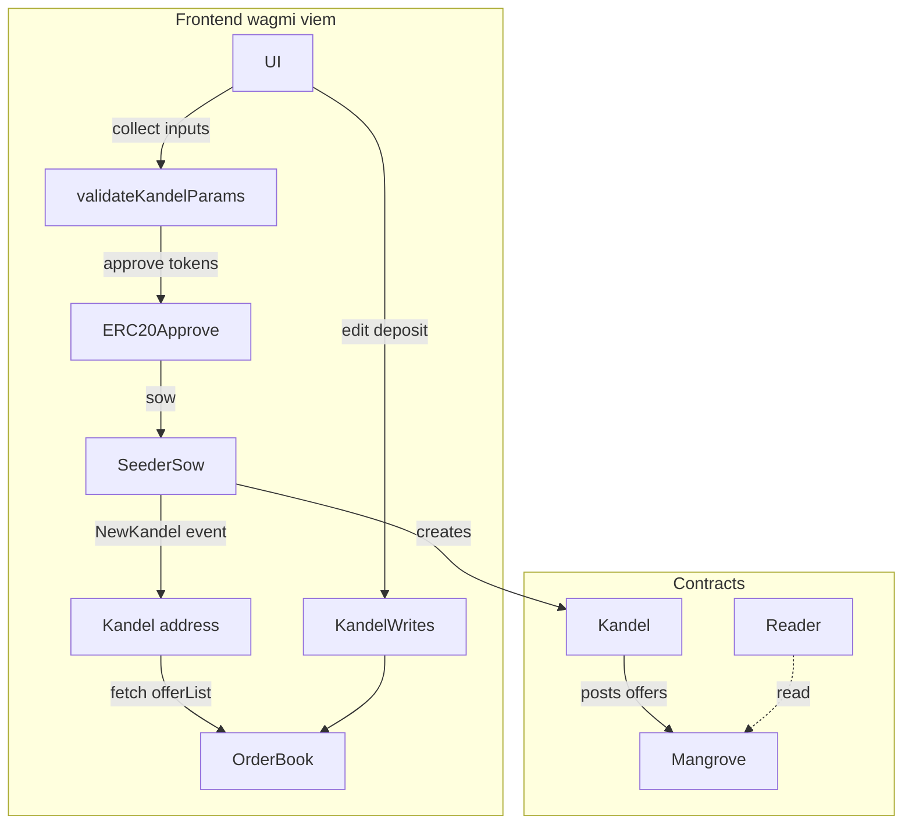

# Kandel Front-End – Full Implementation Plan

This document validates that the workflow drafted in `Implementation_research.md` can be executed with the contracts & TypeScript helpers that exist in the current repository **and** details every on-chain interaction the dApp will perform.

---

## 1. Contract Artefacts Available in the Repo

| Component | Source file(s) | Key functions we will call |
|-----------|----------------|----------------------------|
| **KandelSeeder** | `src/abi/kandelSeeder.ts` | `sow(olKey, liquiditySharing)` → deploys a new `GeometricKandel` instance and emits `NewKandel(owner, olKeyHash, reverseOlKeyHash, kandel)` |
| **MgvReader** | `src/abi/reader.ts` | `getProvision`, `minVolume`, `offerList`, `offerInfo`, `openMarkets` |
| **Mangrove** | `src/abi/mangrove.ts` | `activate`, `deactivate`, `updateMarket` (only needed by the deployment script) |
| **Mock ERC-20** | `src/abi/erc20.ts` | `approve`, `allowance`, `mint`, `balanceOf` |
| **GeometricKandel** (deployed instance) | `src/abi/kandelLib.ts` | `params`, `baseQuoteTickOffset`, `offeredVolume`, `reserveBalance`, `depositFunds`, `withdrawFunds`, `setStepSize`, `setGasreq`, `setGasprice`, `setBaseQuoteTickOffset`, `populate(…)`, `retractOffers`, `retractAndWithdraw` |
| **Kandel helper lib** (frontend-side, not on-chain) | `node_modules/@mangrovedao/mgv/lib/kandel/` | `createGeometricDistribution`, `validateKandelParams`, `countBidsAndAsks`, `getKandelGasReq` |

---

## 2. High-Level User Flows

1. **Wallet & Network**
   • User connects via `@wagmi/connectors` (Injected | WalletConnect | Ledger).  
   • Chain is the local Anvil instance (chainId `31337`).  
   • Deployment script outputs a file `deployments.local.json`; addresses are read from there or from env vars (`NEXT_PUBLIC_MGV_READER`, `NEXT_PUBLIC_KANDEL_SEEDER`, …).

2. **Market Discovery & Order-book View**
   1. Call `MgvReader.openMarkets(withConfig = true)` to list every open market.  
   2. When the user selects a pair, call `MgvReader.offerList(olKey, 0, MAX)` to fetch bids & asks.  
   3. Highlight offers where `offerDetail.maker == userKandelAddress`.

3. **Create Kandel Position**
   1. Collect UI inputs (base, quote, minPrice, maxPrice, midPrice, pricePoints, stepSize, initial Base / Quote inventory).
   2. Convert **human prices → raw ticks** via Kandel helper lib
      ```ts
      const rawParams = getKandelPositionRawParams({
        minPrice, maxPrice, midPrice, pricePoints, market, adjust: true
      });
      ```
   3. Build full param struct & validate:
      ```ts
      const { params, minBaseAmount, minQuoteAmount, minProvision } =
        validateKandelParams({
          ...rawParams,
          baseAmount: parseUnits(baseInit, baseDecimals),
          quoteAmount: parseUnits(quoteInit, quoteDecimals),
          stepSize,
          gasreq: GAS_REQ,          // constant 128_000n (same as Seeder)
          factor: 1,                // 100 % of minVolume
          asksLocalConfig,          // fetched once via reader.configInfo
          bidsLocalConfig,
          marketConfig              // fetched via reader.globalUnpacked
        });
      if (!isValid) throw new Error("Amounts below minVolume");
      *Internally, `validateKandelParams` invokes `createGeometricDistribution` (as required by the README) to turn the geometric skeleton into the concrete bid/ask arrays, so the dApp fully leverages the helper mentioned in the brief.*
      ```
   4. **Approve ERC-20** spending for the Seeder:
      ```ts
      if (baseAmount>0) erc20Base.approve(seeder, baseAmount);
      if (quoteAmount>0) erc20Quote.approve(seeder, quoteAmount);
      ```
   5. **Send deploy tx**
      ```ts
      const { hash } = await publicClient.writeContract({
        address: seeder,
        abi: kandelSeederABI,
        functionName: 'sow',
        args: [
          {  // OLKey = (outbound = base, inbound = quote)
            outbound_tkn: base,
            inbound_tkn: quote,
            tickSpacing: 1n,
          },
          /* liquiditySharing */ false,
        ],
        value: minProvision,
      });
      const receipt = await publicClient.waitForTransactionReceipt({ hash });
      // parse NewKandel event to get `kandel`
      ```

4. **View / Edit Position** (all functions available via `src/abi/kandelLib.ts`):

    • **Read-only** 
     - `params()` → gasprice, gasreq, stepSize, pricePoints (lets us rebuild the UI range sliders).
     - `baseQuoteTickOffset()` & constant `TICK_SPACING` → rebuild min/max price range.
     - `offeredVolume(0/1)` & `reserveBalance(0/1)` → current live liquidity & free balance per side.
     - `offerIdOfIndex` / `indexOfOfferId` → map between Mangrove offer IDs and distribution indices for highlighting

   • **Modify parameters**:
     - `setStepSize(newStep)`
     - `setGasreq(newGasreq)` / `setGasprice(newGasprice)`
     - `setBaseQuoteTickOffset(newOffset)`
     (Each emits a dedicated event the UI can watch.)

   • **Deposit / Withdraw funds**:
     - Add liquidity: `depositFunds(baseAmount, quoteAmount)` after ERC-20 approvals.
     - Partial withdraw: `withdrawFunds(baseAmount, quoteAmount, user)`.

   • **Refresh / repopulate offers** (after changing params or inventory):
     - Use `populate( distribution, params, baseAmt, quoteAmt )` for full repost, or `populateChunk…` for incremental updates.

5. **Full Withdraw + De-register**
   ```ts
   // 1. Retract every live offer and pull funds back to Kandel
   await kandel.retractOffers(0n, params.pricePoints - 1n);

   // 2. Withdraw remaining inventory & accumulated provision in one go
   await kandel.retractAndWithdraw(0n, params.pricePoints - 1n, MAX_UINT, MAX_UINT, /*freeWei*/ 0n, ownerAddress);
   ```

---

## 3. Detailed Call Graph



---

## 4. APR Calculation (brief)

1. Snapshot `{ base, quote }` inventory at `t0`.
2. At every block or X minutes, refetch inventory.
3. **PnL in token terms** = Δbase + Δquote / midPrice.
4. APR ≈ `(Pnl / (initialBase + initialQuote / midPrice)) * (365 days / elapsed)`.

---

Everything else is directly supported by the code currently checked-in; therefore the proposed flow from `Implementation_research.md` is **fully feasible**. 